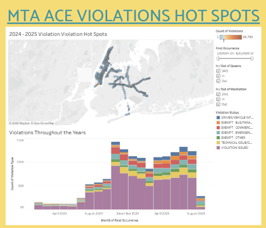
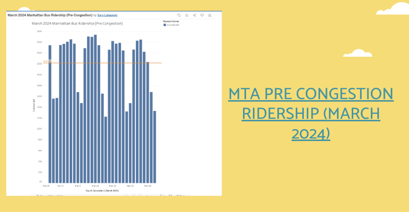
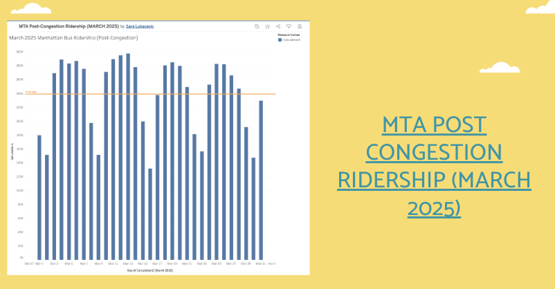
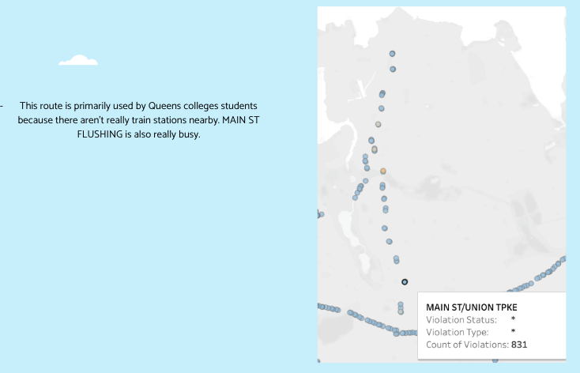
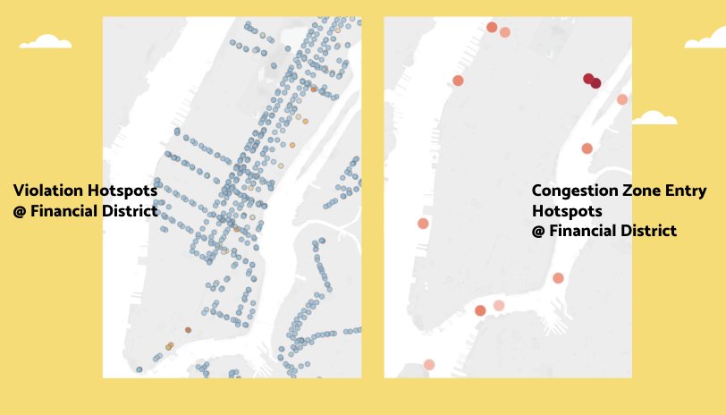
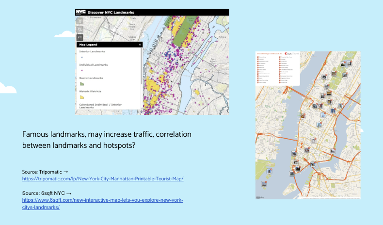
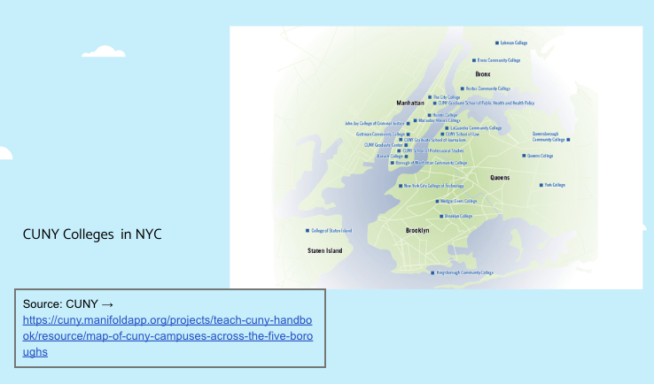

## MHC++ x MTA Datathon 2025
## Team Name - TSZR 
### Team Members - Tiffany, Sara, Zara 
#### [Click on here for Slide Deck](https://docs.google.com/presentation/d/1-3IXw0iE8VQ_0b0aUahq8Otvlld98QaLHnTVF3NJFz0/edit?usp=sharing) 
#### Click here to view Video Explanation: 

# Project Question 

### What factors impact the ACE violations at the largest hotspot? ###

# Contextualizing our Question 

 In this project, we kept these questions in mind: <b> How much do employees, students, and tourists impact the hotspot/ACE violations? </b>
<b>Is it commercial use? Car services? Related bus/train lines? Geographical? How are lanes structured? What demographic makes up these riders? What businesses are around these routes? Public/private schools? Universities?</b> We also compared and contrasted two hotspots [Financial District vs Queens College route] to understand which factors are universal across NYC and which are unique to the dense Central Business district. Finally, we discuss, given our findings, how can we notice these patterns and improve? 

# Our Process

 We started off by brain dumping all of our knowledge on the 3 provided questions. The three of us bring a unique lens to our project and it was crucial to note down these differences to understand our connections and our relation to the MTA. The two boroughs we found most interest and familiarity in were Queens and Manhattan which became the focal points of our project. Using MTA's open data portal, we consolidated various data reports to structure our main ideas. 
 
 The data we used are:

- [MTA Bus Automated Camera Enforcement Violations Beginning October](https://data.ny.gov/Transportation/MTA-Bus-Automated-Camera-Enforcement-Violations-Be/kh8p-hcbm/about_data#)
- [MTA Bus Hourly Ridership: 2020-2024 (362M rows)](https://data.ny.gov/Transportation/MTA-Bus-Hourly-Ridership-2020-2024/kv7t-n8in/about_data)
- [MTA Bus Hourly Ridership: Beginning 2025 (87.6M rows)](https://data.ny.gov/Transportation/MTA-Bus-Hourly-Ridership-Beginning-2025/gxb3-akrn/about_data)
- [MTA Congestion Relief Zone Vehicle Entries: Beginning 2025](https://data.ny.gov/Transportation/MTA-Congestion-Relief-Zone-Vehicle-Entries-Beginni/t6yz-b64h/about_data)

# Visualizing Data 

### Main data 

[MTA ACE VIOLATIONS](https://public.tableau.com/app/profile/tiffany.zhu8039/viz/MTAACEViolations/HotSpots)

[MTA PRE CONGESTION RIDERSHIP (MARCH 2024)](https://public.tableau.com/app/profile/sara.lukacevic/viz/March2024ManhattanBusRidershipPre-Congestion/Sheet1)

[MTA POST CONGESTION RIDERSHIP (MARCH 2025)](https://public.tableau.com/app/profile/sara.lukacevic/viz/MTAPost-CongestionRidershipMARCH20https://public.tableau.com/app/profile/sara.lukacevic/viz/MTAPost-CongestionRidershipMARCH2025/Sheet125/Sheet1)

# Analysis 

[queens](https://public.tableau.com/app/profile/tiffany.zhu8039/viz/MTAACEViolations/HotSpots)

[landmark](https://www.6sqft.com/new-interactive-map-lets-you-explore-new-york-citys-landmarks/)

# Summarizing Final Findings + Insights 

 Ridership for Manhattan buses has increased by nearly 20,000 riders per day on average, with this number being even higher on business days. Signs of increased ridership after congestion pricing was implemented. Violations in Manhattan and Queens have increased, but that has also coincided with many bus routes being added to the ACE program. 45% of ACE violations issued are located in Manhattan and Queens during 2024-2025. 
 

# Final Message + Possible Next Steps

 Analyzing bus speeds as a way to measure the effect of the ACE system on efficiency.
 

 Expanding ridership data to MTA trains to analyze how congestion pricing affected Manhattan public transport ridership as a whole. 

